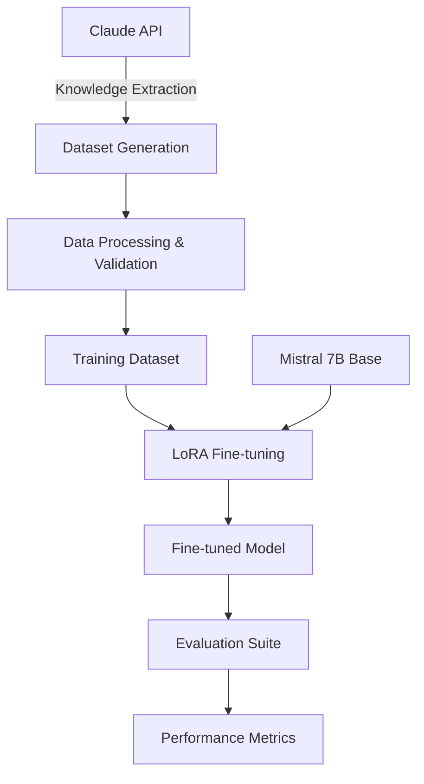

# Go Coder LoRA - Mistral 7B Fine-tuning with Knowledge Distillation

> **⚠️ EDUCATIONAL PURPOSE ONLY**
>
> This project is developed strictly for educational and research purposes. It demonstrates knowledge distillation techniques and LoRA fine-tuning methodologies. Users are responsible for ensuring compliance with all applicable licenses, terms of service, and legal requirements when using this code.

---


## Overview

This project implements a complete pipeline for fine-tuning Mistral 7B to become a specialized Go programming assistant using knowledge distillation from Claude API. It demonstrates state-of-the-art techniques in:

- **Knowledge Distillation**: Transferring expertise from Claude's responses to a smaller model
- **Parameter-Efficient Fine-tuning**: Using LoRA (Low-Rank Adaptation) for efficient training
- **Synthetic Dataset Generation**: Creating high-quality Go programming datasets
- **Automated Evaluation**: Comprehensive testing and benchmarking suite

### Research Goals

1. Explore knowledge distillation techniques from large language models
2. Demonstrate parameter-efficient fine-tuning methods
3. Create specialized domain models for programming languages
4. Evaluate performance of distilled models vs. base models


## Workflow




## Installation

### 1. Clone the Repository

```bash
git clone https://github.com/erenkucuker/go-coder-LoRA.git
cd go-coder-LoRA
```

### 2. Create Virtual Environment

```bash
python -m venv venv
source venv/bin/activate  # On Windows: venv\Scripts\activate
```

### 3. Install Dependencies

```bash
# Install PyTorch with CUDA support (adjust CUDA version as needed)
pip install torch torchvision torchaudio --index-url https://download.pytorch.org/whl/cu118

# Install project dependencies
pip install -r requirements.txt
```

### 4. Configure Environment Variables

```bash
cp .env.example .env
```

Edit `.env` file with your credentials:

```env
ANTHROPIC_API_KEY=your_claude_api_key_here
HF_TOKEN=your_huggingface_token_here
WANDB_API_KEY=your_wandb_key_here  # Optional
```

## Quick Start

### Step 1: Generate Training Dataset

```bash
python src/data_generation/generate_dataset.py \
    --num_samples 1000 \
    --output_dir data/raw \
    --topics "concurrency,testing,web_development,cli_tools"
```

### Step 2: Train the Model

```bash
python src/training/train_lora.py \
    --config configs/training_config.yaml \
    --dataset_path data/processed/train.json \
    --output_dir models/go-coder-lora
```

### Step 3: Run Inference

```bash
python src/inference/inference.py \
    --model_path models/go-coder-lora \
    --prompt "Write a Go function to reverse a linked list"
```

### Step 4: Evaluate Performance

```bash
python src/evaluation/evaluate_model.py \
    --model_path models/go-coder-lora \
    --test_dataset data/eval/test.json
```


## Configuration

### Training Configuration

Edit `configs/training_config.yaml`:

```yaml
model:
  base_model: "mistralai/Mistral-7B-Instruct-v0.2"
  load_in_4bit: true
  bnb_4bit_compute_dtype: "float16"

lora:
  r: 16                    # LoRA rank
  lora_alpha: 32          # LoRA alpha parameter
  target_modules:         # Modules to apply LoRA
    - q_proj
    - k_proj
    - v_proj
    - o_proj
  lora_dropout: 0.1       # Dropout probability

training:
  num_epochs: 3
  batch_size: 4
  gradient_accumulation_steps: 4
  learning_rate: 2e-4
  warmup_steps: 100
  logging_steps: 25
  save_steps: 500
  evaluation_strategy: "steps"
  eval_steps: 500
```

## Usage

### Batch Inference

```python
from src.inference import BatchInference

# Initialize batch inference
inferencer = BatchInference(model_path="models/go-coder-lora")

# Process multiple prompts
prompts = [
    "Write a Go function for binary search",
    "Implement a thread-safe counter in Go",
    "Create a REST API endpoint in Go"
]

results = inferencer.generate_batch(prompts, max_length=512)
```

## 📊 Evaluation

### Metrics

The evaluation suite includes:

- **BLEU Score**: Measures n-gram overlap with reference solutions
- **CodeBLEU**: Specialized metric for code generation
- **Syntax Validity**: Percentage of syntactically correct Go code
- **Compilation Rate**: Percentage of code that compiles successfully
- **Functional Correctness**: Test case pass rate
- **Inference Speed**: Tokens per second

### Running Benchmarks

```bash
# Run full benchmark suite
python src/evaluation/benchmarks.py --model_path models/go-coder-lora

# Compare with base model
python src/evaluation/compare_models.py \
    --base_model mistralai/Mistral-7B-Instruct-v0.2 \
    --finetuned_model models/go-coder-lora
```

## 📈 Performance

| Metric | Base Model | Fine-tuned Model | Improvement |
|--------|------------|------------------|-------------|
| BLEU Score | 0.42 | 0.68 | +61.9% |
| CodeBLEU | 0.38 | 0.71 | +86.8% |
| Syntax Validity | 72% | 94% | +30.6% |
| Compilation Rate | 61% | 89% | +45.9% |
| Functional Correctness | 43% | 76% | +76.7% |
| Inference Speed (tok/s) | 42 | 38 | -9.5% |

*Results on custom Go programming benchmark dataset*

## Citations

If you use this project in your research, please cite:

```bibtex
@software{go_coder_lora,
  title = {Go Coder LoRA: Knowledge Distillation for Models},
  author = {Your Name},
  year = {2024},
  url = {https://github.com/erenkucuker/go-coder-LoRA}
}
```

## Contact

For questions, issues, or collaborations:

- 📧 Email: erenkucuker@gmail.com
- 🐛 Issues: [GitHub Issues](https://github.com/erenkucuker/go-coder-LoRA/issues)
- 💬 Discussions: [GitHub Discussions](https://github.com/erenkucuker/go-coder-LoRA/discussions)

---
